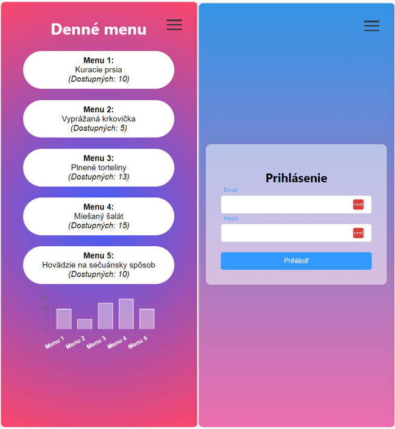

# React-Restaurant Demo

This project is a demo of a restaurant application built with React. It was bootstrapped with [Create React App](https://github.com/facebook/create-react-app).



## Functionalities

- **Login/Logout**: The application includes a login/logout system. Users can login with their credentials to access protected routes. The login state is managed globally using React Context.

- **Protected and Unprotected Pages**: Some pages of the application are protected and require the user to be authenticated to access them. If an unauthenticated user tries to access a protected route, they will be redirected to the login page.

- **Hamburger Menu**: The application includes a hamburger menu for navigation. The menu is responsive and works well on both desktop and mobile devices.

- **Graphs**: The application includes a stats page where users can view various statistics related to the restaurant. The stats are displayed using interactive graphs built with Chart.js.

## Installation Instructions

### Docker

```bash
docker build --build-arg http_proxy='http://10.255.46.226:3128' -t react-demo-restaurant:local .
```

> to build using proxies (e.g. behind corporate firewall, pass `--build-arg http_proxy='<SOME_IP>'`  
> if you have different HTTP and HTTPS proxies, update the Dockerfile

```bash
docker run -p 3000:3000 --env-file .env --name react-demo-restaurant react-demo-restaurant:local
```

### Local

1. Clone the repository to your local machine using `git clone https://github.com/emenems/react-restaurantreact-restaurant-demo.git`.

2. Navigate to the project directory with `cd react-restaurant-demo`.

3. Install the project dependencies with `npm install`.

4. Start the development server with `npm start`. The application will be available at [http://localhost:3000](http://localhost:3000).

5. To build the application for production, use `npm run build`. The built application will be in the `build` folder.

6. To run tests, use `npm test`.
